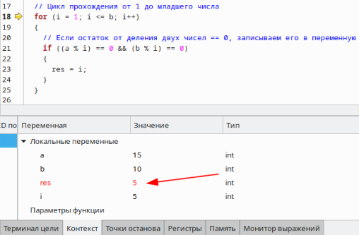

**2 Виконання роботи**

2.1 Створення директорії lab05. Зображено на рис.1.


Рисунок 1 —— створення директорії

2.2 Створення файлу з вихідним кодом. Зображено на рис.2.


Рисунок 2 —— створення файлу з кодом

2.3 Запуск редактора коду. Зображено на рис.3.


Рисунок 3 —— запуск редактора

2.4 Написання коду і коментарів до нього

```C
int nod(int, int);

int get_rand();

int main()
{
  srand(time(0));

  nod(6, get_rand());
  return 0;
}

int nod(int a, int b)
{
  int res;
  int i = 1;

  if (a < b)
  {
    int x = a;
    a = b;
    b = x;
  }

  for (i = 1; i <= b; i++)
  {
    if ((a % i) == 0 && (b % i) == 0)
    {
      res = i;
    }
  }

  return res;
}

int get_rand() {
  int random = rand() % 10 + 1; 
  return random;
}
```

2.5 Компіляція проекту за допомогою команди “make clean prep compile”. Зображено на рис.4.


Рисунок 4 —— компіляція проекту

2.6 Відкрито у відлагоднику nemiver виконуючий файл main.bin. Ставимо точку зупину, проходимо по файлу і бачимо зміну значення в масиві в момент проходження по циклу. Зображено на рис.5.



Рисунок 5 —— файл у відлагоднику

2.7 Створення блок-схеми програми. Зображення блок-схеми на рис.6.


Рисунок 6 —— блок-схема

**Висковки**

Створено програму, яка визначає найбільший спільний дільник для двох заданих чисел.