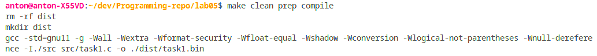

**2 Виконання роботи**

2.1 Створення файлу з вихідним кодом, написання коду і коментарів до нього

```C
int isSimple(int);

int main()
{
    isSimple(17);
	return 0;
}

int isSimple(int n) 
{
    int res = 0;

    for (int i = 2; i <= n; i++)
    {
        if (n % i == 0)
        {
            res += 1;
        }
    }

    if (res > 1) 
    {
        res = 0;
    }
    return res;
}
```

2.2 Компіляція проекту за допомогою команди “make clean prep compile”. Зображено на рис.1.



Рисунок 1 - компіляція проекту

2.3 Відкрито у відлагоднику nemiver виконуючий файл main.bin. Ставимо точку зупину, проходимо по файлу і бачимо зміну значення в масиві в момент проходження по циклу. Зображено на рис.2.


Рисунок 2 - файл у відлагоднику

2.4 Створення блок-схеми програми. Зображення блок-схеми на рис.3.


Рисунок 3 - блок-схема

**Висковки**

Реалізовано функцію, що визначає, чи є задане число простим.