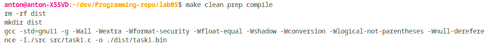
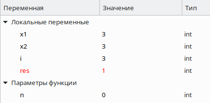
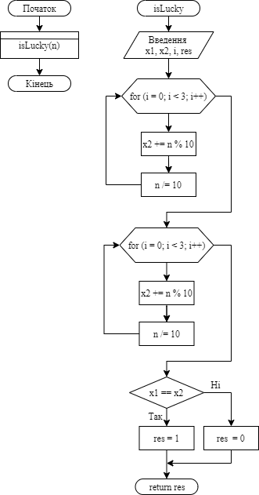

**2 Виконання роботи**

2.1 Створення файлу з вихідним кодом, написання коду і коментарів до нього

```C
int isLucky(int);

int main()
{    
    printf("%d\n", isLucky(102300));
	return 0;
}

int isLucky(int n) {
    int x1 = 0, x2 = 0, i = 0;
    int res;

    for(i=0; i<3; i++)
    {
        x2 += n % 10; 
        n /= 10;
    }

    for(i=0; i<3; i++)
    {
        x1 += n % 10;
        n /= 10;
    }

    if (x1 == x2)
    {
        res = 1;
    } else
    {
        res = 0;
    }
    return res;
}
```

2.2 Компіляція проекту за допомогою команди “make clean prep compile”. Зображено на рис.1.



Рисунок 1 - компіляція проекту

2.3 Відкрито у відлагоднику nemiver виконуючий файл main.bin. Ставимо точку зупину, проходимо по файлу і бачимо зміну значення в масиві в момент проходження по циклу. Зображено на рис.2.



Рисунок 2 - файл у відлагоднику

2.4 Створення блок-схеми програми. Зображення блок-схеми на рис.3.



Рисунок 3 - блок-схема

**Висковки**

Реалізовано функцію, що визначає, чи є ціле 6-значне число "щасливим" квитком ("щасливий квиток" - квиток, в якому сума першої половини чисел номера дорівнює сумі другої половини. Наприклад, білет з номером 102300 є щасливим, бо 1 + 0 + 2 = 3 + 0 + 0). 