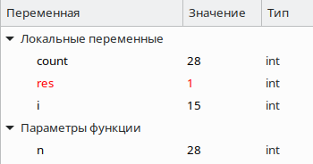
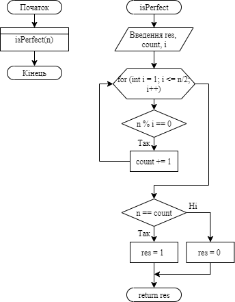

**2 Виконання роботи**

2.1 Створення файлу з вихідним кодом, написання коду і коментарів до нього

```C
int isPerfect(int);

int main()
{
    isPerfect(28);
	return 0;
}

int isPerfect(int n) 
{
    int count = 0;
    int res = 0;
    int i = 1;

    for (i = 1; i <= n/2; i++)
    {
        if (n % i == 0)
        {
            count += i;
        }
    }

    if (n == count)
    {
        res = 1;
    } else
    {
        res = 0;
    }

    return res;
}
```

2.2 Компіляція проекту за допомогою команди “make clean prep compile”. Зображено на рис.1.


Рисунок 1 - компіляція проекту

2.3 Відкрито у відлагоднику nemiver виконуючий файл main.bin. Ставимо точку зупину, проходимо по файлу і бачимо зміну значення в масиві в момент проходження по циклу. Зображено на рис.2.



Рисунок 2 - файл у відлагоднику

2.4 Створення блок-схеми програми. Зображення блок-схеми на рис.3.



Рисунок 3 - блок-схема

**Висковки**

Реалізовано функцію, що визначає, чи є задане число досконалим.