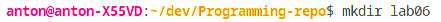
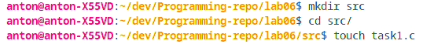
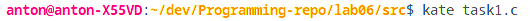
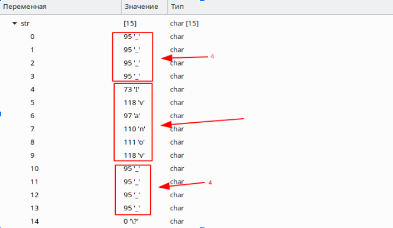
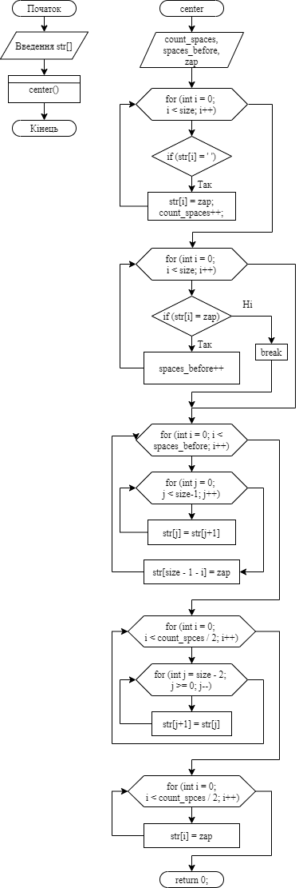

**2 Виконання роботи**

2.1 Створення директорії lab06. Зображено на рис.1.



Рисунок 1 - створення директорії

2.2 Створення файлу з вихідним кодом. Зображено на рис.2.



Рисунок 2 - створення файлу з кодом

2.3 Запуск редактора коду. Зображено на рис.3.



Рисунок 3 - запуск редактора

2.4 Написання коду і коментарів до нього

```C
void center(char str[]);

int main()
{
  char str[] = "Ivanov        ";
  
  center(str);
  return 0;
}

void center(char str[]) {
  char zap = '_';
  int count_spaces = 0;
  int spaces_before = 0;
  int size = 0;

  for (int i = 0; str[i] != '\0'; i++) {
    size += 1;
  }

  for (int i = 0; i < size; i++)
  {
    if (str[i] == ' ')
    {
      str[i] = zap;
      count_spaces++;
    }
  }

  for (int i = 0; i < size; i++)
  {
    if (str[i] == zap)
    {
      spaces_before++;
    }
    else
    {
      break;
    }
  }

  for (int i = 0; i < spaces_before; i++)
  {
    for (int j = 0; j < size - 1; j++)
    {
      str[j] = str[j + 1];
    }
    str[size - 1 - i] = zap;
  }

  for (int i = 0; i < count_spaces / 2; i++)
  {
    for (int j = size - 2; j >= 0; j--)
    {
      str[j + 1] = str[j];
    }
  }

  for (int i = 0; i < count_spaces / 2; i++)
  {
    str[i] = zap;
  }
}
```

2.5 Компіляція проекту за допомогою команди “make clean prep compile”. Зображено на рис.4.


Рисунок 4 - компіляція проекту

2.6 Відкрито у відлагоднику nemiver виконуючий файл main.bin. Ставимо точку зупину, проходимо по файлу і бачимо зміну значення в масиві в момент проходження по циклу. Зображено на рис.5.



Рисунок 5 - файл у відлагоднику

2.7 Створення блок-схеми програми. Зображення блок-схеми на рис.6.



Рисунок 6 - блок-схема

**Висковки**

Створено програму, яка відцентровує слово посеред масиву символів.