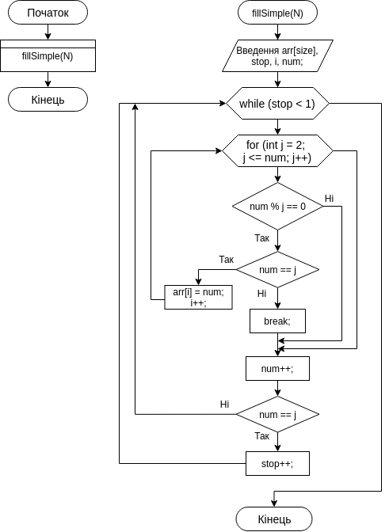

**2 Виконання роботи**

2.1 Створення файлу з вихідним кодом, написання коду і коментарів до нього

```C
const int N = 28;

void fillSimple(int);

int main()
{
  fillSimple(N);
  return 0;
}

void fillSimple(int size)
{
  int arr[size];
  int stop = 0;
  int i = 0;
  int num = 2;

  while (stop < 1)
  {
    for (int j = 2; j <= num; j++)
    {
      if (num % j == 0)
      {
        if (num == j)
        {
          arr[i] = num;
          i++;
        }
        else
        {
          break;
        }
      }
    }
    num++;
    if (i == N)
    {
      stop++;
    }
  }
}
```

2.2 Компіляція проекту за допомогою команди “make clean prep compile”. Зображено на рис.1.


Рисунок 1 - компіляція проекту

2.3 Відкрито у відлагоднику nemiver виконуючий файл main.bin. Ставимо точку зупину, проходимо по файлу і бачимо зміну значення в масиві в момент проходження по циклу. Зображено на рис.2.


Рисунок 2 - файл у відлагоднику

2.4 Створення блок-схеми програми. Зображення блок-схеми на рис.3.



Рисунок 3 - блок-схема

**Висковки**

Створено програму, що заповнює масив простими числами, що не повторюються.