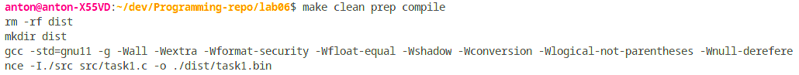

**2 Виконання роботи**

2.1 Створення файлу з вихідним кодом, написання коду і коментарів до нього

```C
void numToStr(int);

int main()
{  
  numToStr(5512);
  return 0;
}

void numToStr(int num) {
  int temp = 0;
  int temp1 = 0;
  int temp2 = 0;
  int temp3 = 0;
  char res[100] = {0};
  const char arr1[10][10] = {"", "one", "two", "three", "four", "five", "six", "seven", "eight", "nine"};
  const char arr2[10][10] = {"ten", "eleven", "twelve", "thirteen", "fourteen", "fifteen", "sixteen", "seventeen", "eighteen", "nineteen"};
  const char arr3[10][15] = {"", "", "twenty ", "thirty ", "fourty ", "fifty ", "sixty ", "seventy ", "eighty ", "ninety "};
  const char arr4[10][15] = {"", "one hundred ", "two hundred ", "three hundred ", "four hundred ", "five hundred ", "six hundred ", "seven hundred ", "eight hundred ", "nine hundred "};
  const char arr5[10][15] = {"", "one thousand ", "two thousand ", "three thousand ", "four thousand ", "five thousand ", "six thousand ", "seven thousand ", "eight thousand ", "nine thousand "};

  for (int i = 0; i <= num / 1000; i++)
  {
    temp = 0;
    for (int j = 0; j < 15; j++)
    {
      res[temp++] = arr5[i][j];
      temp1 = temp;
    }
  }

  for (int i = 0; i <= num / 100 % 10; i++)
  {
    temp = temp1;
    for (int j = 0; j < 15; j++)
    {
      res[temp++] = arr4[i][j];
      temp2 = temp;
    }
  }

  if (num % 100 >= 10 && num % 100 < 20)
  {
    for (int i = 0; i <= num % 10; i++)
    {
      temp = temp2;
      for (int j = 0; j < 10; j++)
      {
        res[temp++] = arr2[i][j];
      }
    }
  }
  else if (num % 100 >= 20)
  {
    for (int i = 0; i <= num / 10 % 10; i++)
    {
      temp = temp2;
      for (int j = 0; j < 10; j++)
      {
        res[temp++] = arr3[i][j];
        temp3 = temp;
      }
    }
    for (int i = 0; i <= num % 10; i++)
    {
      temp = temp3;
      for (int j = 0; j < 10; j++)
      {
        res[temp++] = arr1[i][j];
      }
    }
  }
  else
  {
    for (int i = 0; i <= num % 10; i++)
    {
      temp = temp2;
      for (int j = 0; j < 10; j++)
      {
        res[temp++] = arr1[i][j];
      }
    }
  }

  if (num == 0)
  {
    res[0] = 'z';
    res[1] = 'e';
    res[2] = 'r';
    res[3] = 'o';
  }
}
```

2.2 Компіляція проекту за допомогою команди “make clean prep compile”. Зображено на рис.1.



Рисунок 1 - компіляція проекту

2.3 Відкрито у відлагоднику nemiver виконуючий файл main.bin. Ставимо точку зупину, проходимо по файлу і бачимо зміну значення в масиві в момент проходження по циклу. Зображено на рис.2.


Рисунок 2 - файл у відлагоднику

2.4 Створення блок-схеми програми. Зображення блок-схеми на рис.3.


Рисунок 3 - блок-схема

**Висковки**

Створено програму, що перетворює число (максимальне значення - 9999) в рядок.