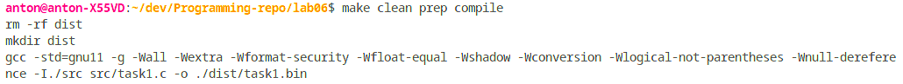
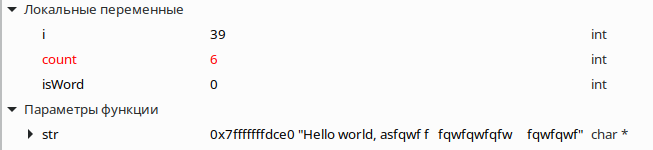
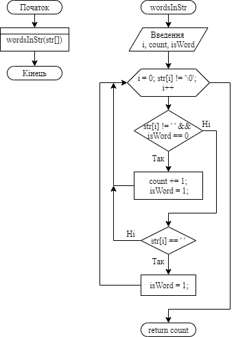

**2 Виконання роботи**

2.1 Створення файлу з вихідним кодом, написання коду і коментарів до нього

```C
int wordsInStr(char[]);

int main()
{
    char str[] = "Hello world, asfqwf f   fqwfqwfqfw     fqwfqwf";
    printf("%d\n", wordsInStr(str));

    return 0;
}


int wordsInStr(char str[])
{
    int i,
        count = 0,
        isWord = 0;

    for (i = 0; str[i] != '\0'; i++)
    {
        if (str[i] != ' ' && isWord == 0)
        {
            count += 1;
            isWord = 1;
        }
        else if (str[i] == ' ')
        {
            isWord = 0;
        }
    }

    return count;
}
```

2.2 Компіляція проекту за допомогою команди “make clean prep compile”. Зображено на рис.1.



Рисунок 1 - компіляція проекту

2.3 Відкрито у відлагоднику nemiver виконуючий файл main.bin. Ставимо точку зупину, проходимо по файлу і бачимо зміну значення в масиві в момент проходження по циклу. Зображено на рис.2.



Рисунок 2 - файл у відлагоднику

2.4 Створення блок-схеми програми. Зображення блок-схеми на рис.3.



Рисунок 3 - блок-схема

**Висковки**

Створено програму, що знаходить кількість слів у заданому тексті.