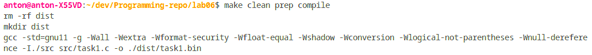
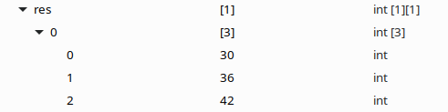
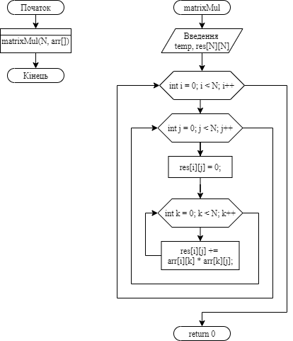

**2 Виконання роботи**

2.1 Створення файлу з вихідним кодом, написання коду і коментарів до нього

```C
const int N = 3;

void fill(int N, int arr[][N]);

void matrixMul(int N, int arr[][N]);

int main()
{
    int arr[N][N];

    fill(N, arr);
    matrixMul(N, arr);
    return 0;
}

void fill(int N, int arr[][N])
{
    for (int i = 0; i < N; i++)
    {
        for (int j = 0; j < N; j++)
        {
            arr[i][j] = i * N + j + 1;
        }
    }
}

void matrixMul(int N, int arr[][N])
{
    int temp = 0;
    int res[N][N];

    for (int i = 0; i < N; i++)
    {
        for (int j = 0; j < N; j++)
        {
            res[i][j] = 0;
            for (int k = 0; k < N; k++)
            {
                res[i][j] += arr[i][k] * arr[k][j];
            }
        }
    }

    for (int i = 0; i < N; i++)
    {
        for (int j = 0; j < N; j++)
        {
            printf("%d\t", res[i][j]);
        }
        printf("\n");
    }
}
```

2.2 Компіляція проекту за допомогою команди “make clean prep compile”. Зображено на рис.1.



Рисунок 1 - компіляція проекту

2.3 Відкрито у відлагоднику nemiver виконуючий файл main.bin. Ставимо точку зупину, проходимо по файлу і бачимо зміну значення в масиві в момент проходження по циклу. Зображено на рис.2.



Рисунок 2 - файл у відлагоднику

2.4 Створення блок-схеми програми. Зображення блок-схеми на рис.3.



Рисунок 3 - блок-схема

**Висковки**

Створено програму, що множить матрицю саму на себе.