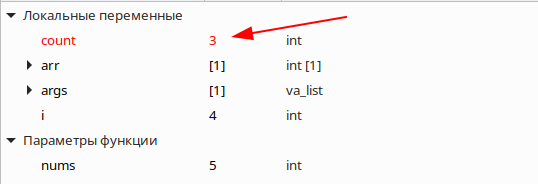
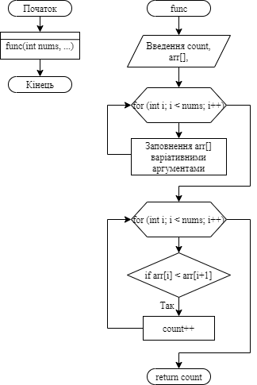

**2 Виконання роботи**

2.1 Створення файлу з вихідним кодом, написання коду і коментарів до нього

```C
int func(int, ...);

int main()
{
    func(5, 6, 5, 4, 5, 6); 
    return 0;
}

int func(int nums, ...)
{
    int count = 0; 
    int arr[nums]; 
    va_list args;  
    va_start(args, nums); 
    for (int i = 0; i < nums; i++) { 
        arr[i] = va_arg(args, int); 
    }
    for (int i = 0; i < nums; i++) {
        if (arr[i] < arr[i+1]) {
            count++;
        }
    }
    va_end(args);
    return count;
}
```

2.2 Компіляція проекту за допомогою команди “make clean prep compile”. Зображено на рис.1.


Рисунок 1 - компіляція проекту

2.3 Відкрито у відлагоднику nemiver виконуючий файл main.bin. Ставимо точку зупину, проходимо по файлу і бачимо зміну значення в масиві в момент проходження по циклу. Зображено на рис.2.



Рисунок 2 - файл у відлагоднику

2.4 Створення блок-схеми програми. Зображення блок-схеми на рис.3.



Рисунок 3 - блок-схема

**Висковки**

Реалізовано функцію з варіативною кількість аргументів, що рахує кількість пар чисел у котрих перше число менше наступного.